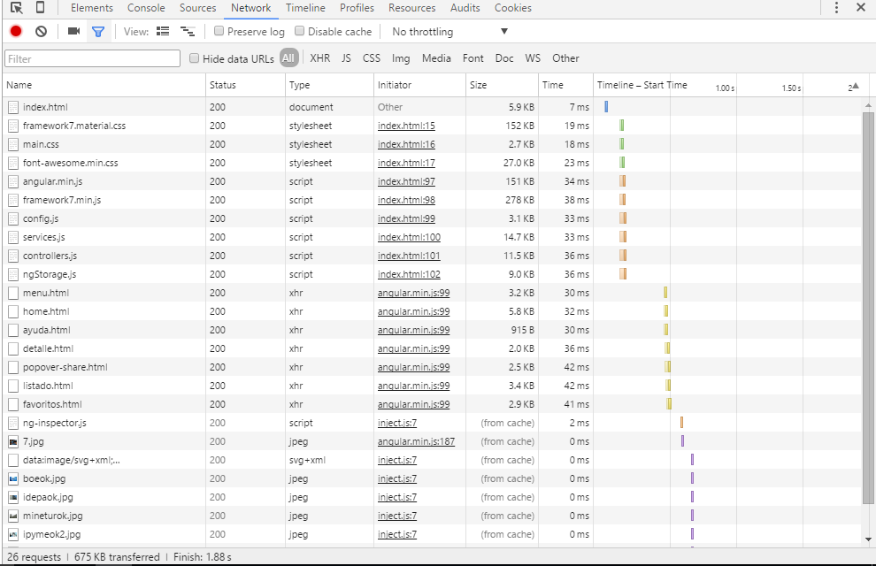
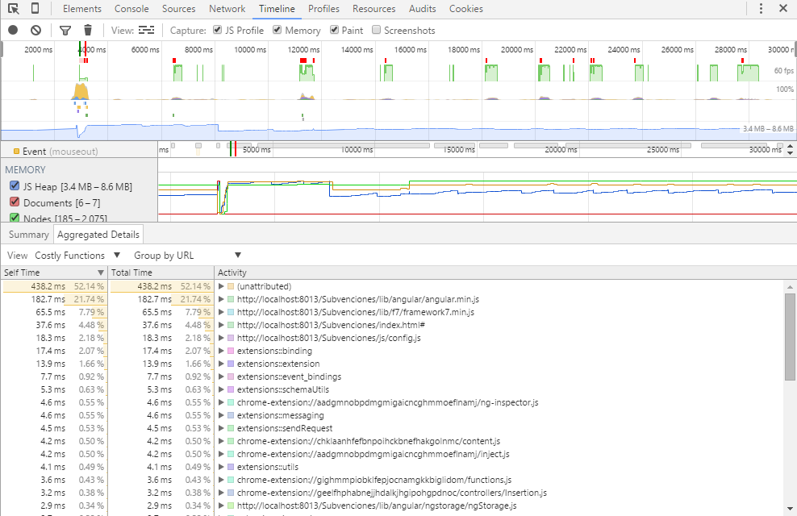

# Busca Fondos

Buscador de fondos públicos y subvenciones para smartphone.

La aplicación se encarga de recopilar datos de diversos organismos e instituciones y presentarlos de forma homogénea. Además, 
facilita la consulta de los mismos de una forma centralizada, rápida y eficiente. 

[VER ONLINE](https://yagolopez.github.io/Buscador_Subvenciones/iframe.html)

Los fondos pueden ser de ámbito europeo, nacional, regional o local. La aplicación está particularizada para buscar fondos 
en el Principado de Asturias aunque también es válida a nivel nacional.

Las fuentes de datos son las siguientes (se podrían añadir más fuentes en el futuro):

- BOE: Boletín Oficial del Estado
- IDEPA: Institudo para el Desarrollo Económico del Principado de Asturias
- MINETUR: Ministerio de Industría, Energía y Turismo
- DGPYME: Dirección General de Industria y de la Pequeña y Mediana Empresa
- BDNS: Base de Datos Nacional de Subvenciones

Tecnologías empleadas:
 
- Framework 7 (Interfaz de usuario)
- AngularJS (Arquitectura MVVC y Two way data binding)
- Apache Cordova/PhoneGap (Acceso a API de móvil mediante Javascript)
- Intel Crosswalk Runtime (Compilación cruzada a Android e IOS)
 
Probado en:
 
- Chrome (últimas versiones)
- Microsoft Edge
- Internet Explorer (últimas versiones)
- Android
- IOS (emulador)
 
Por hacer:

- Búsqueda global (buscar en todos los organismos de una sola vez)
- Añadir organismo: Gobierno de Asturias
---

# Auditoría

## Red: tiempos de carga

## Memoria: actividad del recolector de basura, funciones mas costosas, etc

# Estudio de responsividad

[Acceder](http://www.responsinator.com/?url=yagolopez.github.io%2FBuscador_Subvenciones)
